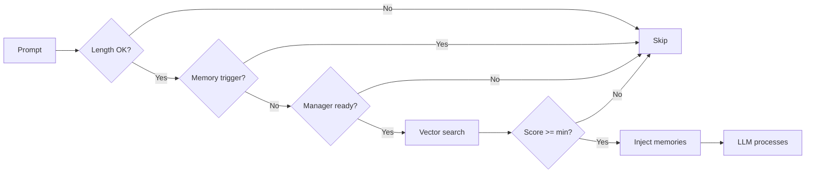
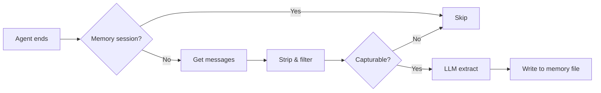

# openclaw-memory-core-plus

[English](./README.md) | [中文](./README.zh-CN.md)

> Enhanced workspace memory with auto-recall and auto-capture for OpenClaw.

## Overview

`openclaw-memory-core-plus` is an OpenClaw plugin that extends the built-in `memory-core` with two automated hooks:

- **Auto-Recall** -- Before each LLM turn, semantically search workspace memory and inject relevant memories into the prompt context.
- **Auto-Capture** -- After each agent run, extract durable facts, preferences, and decisions from the conversation and persist them to memory files.

Together they form a closed-loop memory system: information captured from past conversations is automatically surfaced when contextually relevant in future interactions.

## Installation

```bash
openclaw plugins install openclaw-memory-core-plus
```

## Configuration

### Quick Setup (CLI)

```bash
# Enable the plugin and auto-select memory slot
openclaw plugins enable memory-core-plus

# Enable auto-recall
openclaw config set plugins.entries.memory-core-plus.config.autoRecall true

# Enable auto-capture
openclaw config set plugins.entries.memory-core-plus.config.autoCapture true
```

### Full Configuration (openclaw.json)

```jsonc
{
  "plugins": {
    "entries": {
      "memory-core-plus": {
        "enabled": true,
        "config": {
          "autoRecall": true,
          "autoCapture": true
        }
      }
    },
    "slots": {
      "memory": "memory-core-plus"
    }
  }
}
```

> **Important:** The `plugins.slots.memory` field must be set to `"memory-core-plus"` to activate this plugin as the memory provider. Running `openclaw plugins enable memory-core-plus` handles this automatically. Do not enable `memory-core` at the same time -- they would register duplicate tools.

### Configuration Reference

| Key | Type | Default | Description |
|-----|------|---------|-------------|
| `autoRecall` | `boolean` | `false` | Enable automatic memory recall before each agent turn |
| `autoRecallMaxResults` | `number` | `5` | Maximum number of memories to inject per turn |
| `autoRecallMinScore` | `number` | `0.7` | Minimum relevance score threshold (0 -- 1) |
| `autoRecallMinPromptLength` | `number` | `5` | Minimum prompt length (chars) to trigger recall |
| `autoCapture` | `boolean` | `false` | Enable automatic memory capture after each agent run |
| `autoCaptureMaxMessages` | `number` | `10` | Maximum recent messages to analyze for capture |

## How It Works

### Auto-Recall

Registered on the `before_prompt_build` hook. Triggered every time the user sends a message, **before** the LLM processes it.



The recall hook skips execution when:
- The prompt is shorter than `autoRecallMinPromptLength`
- The trigger is `"memory"` (avoids recall during memory-related subagent runs)
- No memory search manager is available (e.g., no embeddings configured)

### Auto-Capture

Registered on the `agent_end` hook. Triggered every time an agent run **completes**.



The capture hook includes multiple recursion guards:
- Checks `ctx.trigger === "memory"` to skip memory-triggered runs
- Checks `ctx.sessionKey` for `:memory-capture:` marker (the subagent uses this session key pattern)
- Uses `idempotencyKey` to prevent duplicate captures

## Security

- **Prompt injection detection**: Messages containing patterns like "ignore previous instructions", "you are now", "jailbreak", etc. are filtered out before capture.
- **HTML entity escaping**: All memory content injected into prompts is escaped (`&`, `<`, `>`, `"`, `'`) to prevent markup injection.
- **Untrusted data marking**: Recalled memories are wrapped in `<relevant-memories>` tags with an explicit instruction to treat them as untrusted historical data.
- **Recall marker stripping**: Before capture, any `<relevant-memories>` blocks are stripped from conversation text to avoid persisting injected context as new memories.
- **Recursion prevention**: The capture subagent's session key contains `:memory-capture:`, and the hook checks both `trigger` and `sessionKey` to break potential infinite loops.

## Relationship to memory-core

This plugin is a **superset** of the built-in `memory-core` plugin. It inherits and re-registers the same `memory_search` and `memory_get` tools, as well as the `memory` CLI command. On top of that, it adds the auto-recall and auto-capture hooks.

## License

MIT
