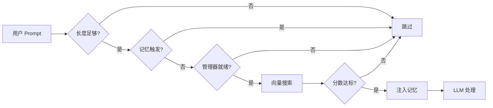
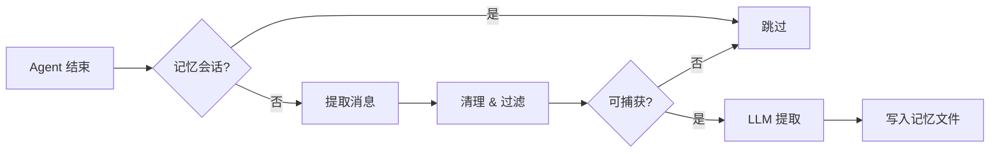

# openclaw-memory-core-plus

[English](./README.md) | [中文](./README.zh-CN.md)

> OpenClaw 增强型工作区记忆插件，支持自动回忆和自动捕获。

## 概述

`openclaw-memory-core-plus` 是一个 OpenClaw 插件，在内置的 `memory-core` 基础上增加了两个自动化 hook：

- **Auto-Recall（自动回忆）** -- 每次 LLM 处理前，对工作区记忆进行语义搜索，将相关记忆注入到 prompt 上下文中。
- **Auto-Capture（自动捕获）** -- 每次 agent 运行结束后，从对话中提取持久化的事实、偏好和决策，写入记忆文件。

两者形成闭环记忆系统：过去对话中捕获的信息会在未来交互中根据语义相关性自动浮现。

## 安装

```bash
openclaw plugins install openclaw-memory-core-plus
```

## 配置

### 快速设置（命令行）

```bash
# 启用插件并自动选择 memory slot
openclaw plugins enable memory-core-plus

# 启用自动回忆
openclaw config set plugins.entries.memory-core-plus.config.autoRecall true

# 启用自动捕获
openclaw config set plugins.entries.memory-core-plus.config.autoCapture true
```

### 完整配置（openclaw.json）

```jsonc
{
  "plugins": {
    "entries": {
      "memory-core-plus": {
        "enabled": true,
        "config": {
          "autoRecall": true,
          "autoCapture": true
        }
      }
    },
    "slots": {
      "memory": "memory-core-plus"
    }
  }
}
```

> **重要：** `plugins.slots.memory` 必须设置为 `"memory-core-plus"` 才能将本插件激活为记忆提供者。运行 `openclaw plugins enable memory-core-plus` 会自动完成此设置。请勿同时启用 `memory-core`，否则会注册重复的工具。

### 配置参数

| 参数 | 类型 | 默认值 | 说明 |
|------|------|--------|------|
| `autoRecall` | `boolean` | `false` | 启用自动回忆（每次 agent 处理前自动搜索相关记忆） |
| `autoRecallMaxResults` | `number` | `5` | 每次注入的最大记忆条数 |
| `autoRecallMinScore` | `number` | `0.7` | 最低相关性分数阈值（0 -- 1） |
| `autoRecallMinPromptLength` | `number` | `5` | 触发回忆的最短 prompt 长度（字符数） |
| `autoCapture` | `boolean` | `false` | 启用自动捕获（每次 agent 运行结束后自动提取记忆） |
| `autoCaptureMaxMessages` | `number` | `10` | 分析捕获的最大近期消息数 |

## 工作原理

### Auto-Recall（自动回忆）

注册在 `before_prompt_build` hook 上。每次用户发送消息、LLM 处理**之前**触发。



以下情况会跳过回忆：
- prompt 长度短于 `autoRecallMinPromptLength`
- trigger 为 `"memory"`（避免在记忆相关的 subagent 运行中触发回忆）
- 记忆搜索管理器不可用（例如未配置 embeddings）

### Auto-Capture（自动捕获）

注册在 `agent_end` hook 上。每次 agent 运行**结束后**触发。



捕获 hook 包含多重递归防护：
- 检查 `ctx.trigger === "memory"` 跳过记忆触发的运行
- 检查 `ctx.sessionKey` 是否包含 `:memory-capture:` 标记（subagent 使用此 session key 模式）
- 使用 `idempotencyKey` 防止重复捕获

## 安全机制

- **Prompt injection 检测**：包含 "ignore previous instructions"、"you are now"、"jailbreak" 等模式的消息会在捕获前被过滤。
- **HTML 实体转义**：注入 prompt 的所有记忆内容会进行 HTML 转义（`&`、`<`、`>`、`"`、`'`），防止标记注入。
- **不可信数据标记**：回忆的记忆以 `<relevant-memories>` 标签包裹，并附带明确指令将其视为不可信的历史数据。
- **回忆标记清除**：捕获前会从对话文本中移除所有 `<relevant-memories>` 块，避免将注入的上下文作为新记忆持久化。
- **递归防护**：捕获 subagent 的 session key 包含 `:memory-capture:`，hook 同时检查 `trigger` 和 `sessionKey` 以打破潜在的无限循环。

## 与 memory-core 的关系

本插件是内置 `memory-core` 插件的**超集**。它继承并重新注册了相同的 `memory_search` 和 `memory_get` 工具，以及 `memory` CLI 命令。在此基础上增加了 auto-recall 和 auto-capture hook。

## 许可证

MIT
